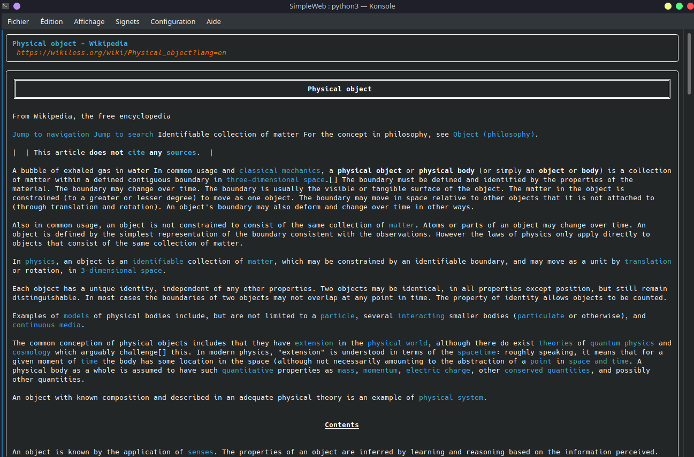

# SimpleWeb

   <a href="https://discord.com/invite/sPvJmY7mcV"></a>

Browse the internet easily from the console.

## Installation

* Install all dependencies : ``pip install -r requirements.txt``.
* Edit `config.example.json`:

```Javascript
{
    "resultPreviewLimit": 5, // 0 = Fast, 5 = Recommended, 10+= Slow
    "resultLimit": 20,
    "defaultBrowser": "google", // available: google, duckduckgo, brave and startpage
    "browserPrefixes": {
        "-g": "google",
        "-d": "duckduckgo",
        "-b": "brave",
        "-s": "startpage"
    },
    "browserSearch": {
        "google": "https://www.google.com/search?q=",
        "duckduckgo": "https://html.duckduckgo.com/html?q=",
        "brave": "https://search.brave.com/search?q=",
        "startpage": "https://www.startpage.com/do/search?q="
    },
    "browserDomainsBackList":{
        ...
    },
    "spaceBetweenResults": true,
    "clear": true,
    "removeYoutubeResults": true,
    "removeGoogleTranslatorResults": true,
    "blackListDomains": [],
    "blackListTags": ["script", "head", "footer", "header", "style", "button", "iframe", "img", "picture", "video", "svg", "span", "form", "nav", "menu", "input"] // You can remove "span" if it takes away important information
}
```
* Rename it to `config.json`.

Finally, launch the script.

## Features

* History system
* Tab system
* Google, DuckDuckGo, BraveSearch and StartPage support
* Customizable
* And more...

## Commands

| Commands                    | Action                                                                         |
|-----------------------------|--------------------------------------------------------------------------------|
| **:s** \<query>  <br> **:search** \<query> | Search the query on the default browser (write the number of the result to see the website) |
| **:s** -\<browserPrefix> \<query>  <br> **:search** -\<browserPrefix> \<query> | Search the query on a specific browser (write the number of the result to see the website) |
| **:ws** \<url> <br> **:website** \<url>    | Display a website                                                              |
| **:h** <br> **:history**                 | See the history                                                                |
| **:t** <br> **:tab** <br> **:tabs**               | See the list of tabs                                                           |
| **:t** -s \<tabNumber>           | Select a specific tab                                                          |
| **:t** \<query>                  | Create a new tab and search the query on Google                                |
| **:c** <br> **:clear**                   | Clear                                                                          |
| **:config** <br> **:settings**                   | Display the settings                                                           |

## Preview

### Search


### Website


### History


## Discord

Join the Discord server !

[](https://discord.gg/sPvJmY7mcV)

## Contributing

Pull requests are welcome. For major changes, please open an issue first to discuss what you would like to change.

Please make sure to update tests as appropriate.

## License

This project is under [GPLv3](https://github.com/Darkempire78/Raid-Protect-Discord-Bot/blob/master/LICENSE).
